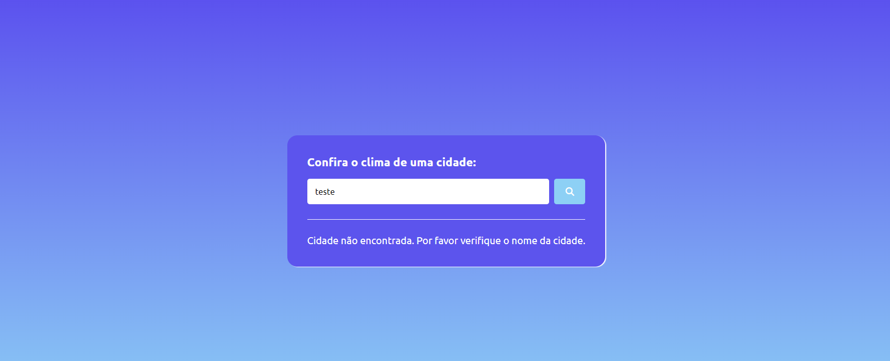

#Consultar Clima:

Criei uma ferramenta simples e eficaz para verificar o clima em qualquer cidade ou país usando HTML, CSS e JavaScript. Com apenas um clique, você pode acessar informações meteorológicas precisas fornecidas pela Weather API.

#Experimente o Consultar clima: 

https://amandamoreirainfo.github.io/consulta_clima/

#Capturas de telas

